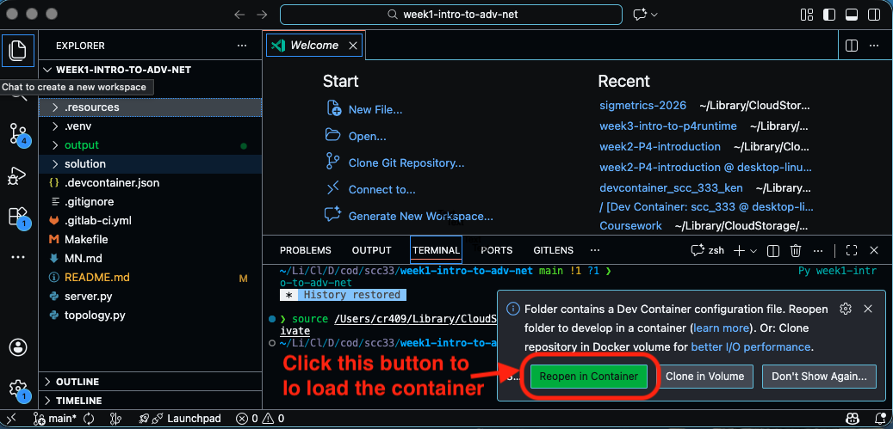
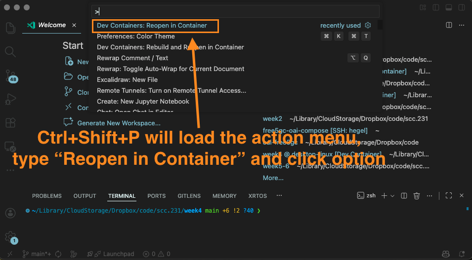
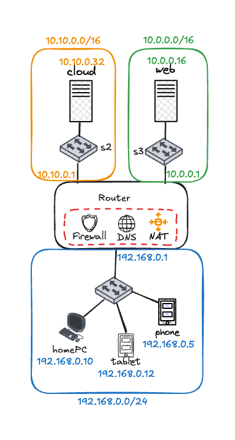

# SCC.333 Week 2: Introduction to P4 Programming

This week's activity introduces you to P4 programming by guiding you through the process of building a simple packet-forwarding pipeline. This activity aims to support the lecture we will have this week on the P4 language and provide you with the hands-on experience of using SDN in practice. We will use the P4 throughout this lab, so please do not simply copy and paste code during the task; rather, try to understand how and why. By the end of this exercise, you will have a basic understanding of how to define packet headers, parse packets, and implement forwarding logic using P4. Our work will build upon the knowledge you gained from the Wireshark exercise earlier in the course. **If you have not completed that exercise, please do so before proceeding.**

By the end of this exercise, you will be able to:

- Understand the structure of network packets and their headers
- Define custom packet headers in P4
- Implement a basic packet parser
- Create a simple forwarding logic based on packet headers

## Network Layering Recap

Before we dive into building our own P4 switch for our home network, we need to review some key design principles for modern networks. At the heart of network technologies lies the concept of packets, the fundamental unit of communication. As we saw using Wireshark, hosts within a network communicate by sending and receiving packets. Each packet consists of multiple headers, stacked on top of one another, followed by the actual data (payload). This follows the wider layering philosophy of modern networks, where network functionality is split across network layers (TCP/IP: physical layer, data link layer, network layer, transport layer, application layer). Each layer typically requires a corresponding header in every packet, containing specific information about the packet, such as how it should be handled, where it’s coming from, and where it’s going, and its association with other packets of the same stream. Understanding these headers is essential because switches and routers rely on them to make forwarding decisions.

``` 
+-----------------------------+
| Ethernet Header (MAC)       |  ← Used by switches
+-----------------------------+
| IP Header (IP Address)      |  ← Used by routers
+-----------------------------+
| TCP / UDP Header            |  ← Used by applications
+-----------------------------+
| Payload (Actual Data)       |  ← Message, file, video, etc.
+-----------------------------+
```

Below is a brief overview of the most common headers found in network packets:

- The *Ethernet* Header (Layer 2 – Data Link) contains information to support packet delivery within a network. Switches use this header to forward packets, while each network interface has a unique MAC address. **This header is modified on every hop as packets move between networks.** An Ethernet header contains the following header fields:

  - *Source MAC address*: who sent the packet
  - *Destination MAC address*: who should receive it next
  - *EtherType*: indicates what protocol comes next (e.g., IPv4, IPv6, ARP)

- The *IP* Header (Layer 3 – Network) contains information for packet delivery across networks. Networks use this header to route packets between different networks and each network host has one or more IP addresses. **This header should remain unchanged as packets traverse networks.** Some of the key fields in the IP header are the following:

  - *Source IP address*, *Destination IP address*: who sent and who should receive the packet
  - *Protocol* fieldL describes which transport protocol is being used (TCP, UDP, ICMP, etc.)
  - *TTL (Time To Live)*: Decremented on every hop, and packets with a value of 0 are discarded to prevent infinite looping
  - Header *length*: describes the size of the IP header

- The *ICMP* Header (Layer 3 - Network) is used for IP and transport diagnostics and error reporting. Commonly used by tools like ping and traceroute, it contains fields such as Type and Code to specify the nature of the message. ICMP packets do not carry application data.

- The *UDP* or *TCP* header (Layer 4 – Transport Layer) contains information about how the packet is transmitted between applications on different hosts. The header is typically processed on the end-hosts only and it contains information about which application on a host is sending or receiving the packet, as well as providing some additional services, like flow control and error checking. TCP offers reliable delivery with congestion control, while UDP is faster but does not guarantee delivery. Some of the key fields in the TCP/UDP header are:

  - *Source port* and *Destination port*: identify which application is sending/receiving the packet
  - *Sequence number* (TCP only): used for ordering packets
  - *Flags* (TCP only): control bits for connection management (SYN, ACK, FIN, etc.)

- Application layer (HTTP, DNS, FTP) protocols (Layer 7) typically define dedicated header format to convey per protocol interactions (e.g., request an HTTP objects). Header encoding can use either text-based formats (like HTTP) or binary formats (like DNS) and format widely varies between protocols.

- It is not uncommon for packets to include *optional or special headers* that provide additional functionality. These headers are not part of the core packet structure but are used to support specific network features or services. Examples include VLAN tags for network segmentation, MPLS headers for efficient routing in service provider networks, and IPsec headers for secure communication. **Network devices usually do not inspect this, unless deep packet inspection is enabled.**

- Optional or special headers are not present in every packet. They are added only when specific network features or services are required. These headers allow networks to provide advanced functionality beyond basic packet forwarding, without changing the core packet structure.


<!-- ## Analogy: Sending a Letter
Think of a packet like mailing a letter:
- Ethernet header → Office mailroom instructions
- IP header → City and street address
- TCP/UDP header → Delivery instructions (urgent or careful)
- Payload → The letter itself

Each network device only reads the part it cares about! -->

To process each of these headers, network devices such as switches and routers use predefined rules to inspect specific fields and make forwarding decisions based on them. Each device needs its own configuration to determine how to handle packets based on the protocols and services it supports, while distributed protocols, such as OSPF and BGP, help routers dynamically learn about the network topology and update their forwarding tables accordingly. These properties were sufficient for network requirements in the early days of the Internet, but as networks have evolved, the need for more flexibility and programmability has become apparent. This is where P4 comes in.


## Why This Matters for P4 & SDN
P4 (Programming Protocol-Independent Packet Processors) is a programming language designed to give developers control over how packets are processed in network devices. It allows you to define how packets are parsed, processed, and forwarded, enabling the creation of custom network functions and behaviours.
Normally, switches and routers are like robots with fixed instructions:
> “I only understand Ethernet, IP, TCP… don’t ask me to do anything else.”
P4 changes that.

With P4, you get to say:
>“Hey switch, this is what a packet looks like, this is how I want you to read it, and this is what I want you to do with it.”

### In other words:
P4 = Programming Your Network Like a Game Character
- You define what headers exist
- You define how packets are processed
- You define what actions to take
- You control the rules of the game

### Why P4 Is Cool?
- You’re not stuck with predefined protocols
- You can build custom routers and switches
- You get full control over packet forwarding logic

### Analogy: A Custom Recipe
Traditional networking is like ordering from a fixed menu.

P4 lets you write your own recipe:
- Choose the ingredients (packet headers)
- Decide how to cook them (packet processing)
- Decide who gets served (forward, drop, modify)

## Task 0: Starting your 333 devcontainer environment

To simplify lab coding, we use a technology called containerisation to package everything you need to run our lab activities in a pre-configured environment. You might have heard of Docker containers, which are lightweight, portable, and consistent virtual instances that can run applications and services.

In order to open the code in a devcontainer, you should select the option `Open In devcontainer` when opening the folder in VSCode. If you missed the option when openning the project, you can still setup the devcontainer. Use the key combination of Ctrl+Shift+P to open the command palette and then select **Dev Containers: Open Folder in Container...**. Both options are depicted in the screenshots below.

{width="5in"}

{width="5in"}

If you have opened the devcontainer correctly, you should see the following prompt when opening a new terminal in VSCode:

{width="5in"}

## Task 1: Using P4 in our home network scenario

For this first task, we will reuse the home network topology from the first week and replace the Linux Switch node with a P4 switch. The updated topology file will replace the home switch with a P4 switch, which we will use to host our custom P4 applications. 

{width="5in"}

A P4 switch is a network device that enables developers to implement and run custom packet-processing programs written in the P4 language. There are several P4 switch implementations, some of which use real hardware to implement the P4 pipeline, such as Barefoot Tofino. In this exercise, we will use the Stratum software switch, an open-source implementation of a P4-programmable switch. Stratum supports the P4 Runtime API, which allows us to program the switch using a P4 program using the GRPC protocol. The switch is designed to implement the P4 v1 model, a standard architecture for P4 programmable switches. It is not designed for high performance, but rather for learning and experimentation purposes.

The developers of the Stratum platform provide a Mininet Switch class called `Stratum`, defined in `p4_mininet/stratum.py`, that allows developers to run Stratum switches in their topology. This class extends the basic Mininet `Switch` class and adds all the functionality needed to run a P4 switch using the Stratum software switch. You can check the implementation of this class to understand how it works, **but you do not need to modify or understand the code for this exercise**.

In order to add a P4 switch to the topology, you will have to modify the `mininet/topo.py` file. In this file, you will find the definition of the home network topology. You will have to replace the `LinuxSwitch` node with a `Stratum` node. You should replace your original switch definition with the following code:

```python
s1 = self.addSwitch('s1', cls=StratumBmv2Switch, grpcPort=50001)
```
If you now run the topology with the command `make start`, you should see that the switch starts using the Stratum software switch. You can check the logs of the switch using the command `docker logs <container_id>`, where `<container_id>` is the ID of the switch container. You can find the container ID with the `docker ps` command. At the moment, the switch is not doing anything, since we have not loaded any P4 program yet. In the next step, we will load a simple P4 program that makes the switch act as a packet repeater.

To simplify your interactions with the mininet topology and the P4 program, we have created a simple Makefile that you should use to start and stop the topology, build your P4 program, and open a terminal to the mininet session. You can use the following commands to interact with the topology:

- `make start`: This command will start the mininet topology  defined in the file `mininet/topo.py`. 
- `make stop`: This command will stop the mininet topology and clean up all the resources used by the topology.
- `make p4build`: This command will compile the P4 program defined in the file `p4src/main.p4` and generate the necessary files to run the P4 program in the Stratum software switch. If you update your P4 program, you should first stop the topology using `make stop`, then run `make p4build` to compile the new program, and finally start the topology again using `make start`.
- `make clean`: Stop the topology and clean up all the resources used by the topology.

**Your goal for this task is to modify the topology file to use a P4 switch instead of a Linux switch and start the Mininet topology.** The switch offers a couple of ways to debug and troubleshoot its behaviour. Once the P4 switch has started, you will find a `tmp/` folder in your working directory. This folder contains the switch logs, which you can use to debug any issues with your P4 program. If your P4 switch is loaded successfully, you should see a log file called `stratum_bmv2-<switch_name>.log`, where `<switch_name>` is the name of the switch in the topology (in our case `s1`). You can use the command `tail -f tmp/stratum_bmv2-s1.log` to follow the logs of the switch in real-time.

```
E0106 11:32:47.355383    88 main.cc:121] Starting bmv2 simple_switch and waiting for P4 pipeline
```

You can connect to the mininet CLI using the command `make mn-cli`. At the moment, the switch is not doing anything, since we have not loaded any P4 program yet. You can now connect to the Mininet CLI and run the command `> phone python send_receive.py 192.168.0.5`. This program will send a packet from the phone host to the switch. Since the switch is not doing anything, the packet will be dropped, and you will not see any output in the app. In the next step, we will load a simple P4 program that makes the switch act as a packet reflector, forwarding the packet back to the sender.

> If you have a message when you run the command `make start` like the following:
>```
>  - ERROR! While parsing input runtime configuration: file does not exist /home/user/h-drive/week2-P4-introduction/mininet/../p4src/build/p4info.txt
>```
> Do not worry about it, this is expected since we have not built any P4 program yet. We will build our first P4 program in the next step.

## Task 2: Introduction to P4 programming

P4 is a high-level programming language designed for programming packet processors, such as switches and routers. It allows developers to define how packets are processed and forwarded through the network. P4 is a domain-specific language focused on the data plane of network devices, enabling flexible, programmable packet processing. In SCC.231, we discussed the different types of network devices (e.g., switches, routers, hubs) and their functionalities. P4 tries to abstract the functionalities of these devices and provide a unified programming model for packet processing, which allows the same device to behave as a switch, router, firewall, etc., depending on the P4 program loaded into it.

The P4 language looks a lot like C, with similar syntax and constructs. However, P4 has some unique features that make it suitable for programming packet processors. Some of the key features of P4 include:

- **Data Types**: All data types in P4 are of fixed size, which allows for efficient packet processing. P4 supports basic data types such as `bit`, `int`, and `bool`, as well as complex data types such as `struct` and `header`. Some C types, like pointers, are not supported in P4.
- **Code Blocks**: Unlike C, P4 does not have functions. Instead, P4 uses code blocks to define the packet processing logic. Code blocks are similar to C functions, but they do not return values. A block has a specific purpose, such as parsing or processing packets, which defines the types of parameters a function can accept or return. The blocks are designed so they can be dropped into the processing pipeline of a hardware chip and chained together to form a complete packet-processing pipeline.
- **Control Flow**: P4 supports control flow constructs such as `if`, `else`, and `switch`, which allow developers to define complex packet processing logic. However, P4 does not support loops, as they can lead to unpredictable packet processing times.
- **Variables**: P4 supports variables, but they are limited in scope and lifetime. Variables can be defined within code blocks and are accessible only within those blocks. P4 does not support global variables or static variables.
- **Tables**: P4 provides a powerful abstraction for matching packet headers and performing actions on them. Tables can be defined with different match types (exact, ternary, longest-prefix match) and populated with entries at runtime using the P4 Runtime API.

As part of the tutorial, we offer a skeleton P4 program located in the file `p4src/main.p4`. This program contains the basic structure of a P4 program, including header definitions, parser, and control blocks. Its functionality is limited and redirects all incoming packets to the same port they arrived on.


```C
#include <core.p4>
#include <v1model.p4>

typedef bit<48> macAddr_t;

struct metadata {
    /* empty */
}

struct headers {
}

parser MyParser(packet_in packet,
                out headers hdr,
                inout metadata meta,
                inout standard_metadata_t standard_metadata) {
      state start{
          transition accept;
      }
}

control MyVerifyChecksum(inout headers hdr, inout metadata meta) {
    apply {  }
}


control MyIngress(inout headers hdr,
                  inout metadata meta,
                  inout standard_metadata_t standard_metadata) {
       //Set Output port == Input port
       standard_metadata.egress_spec = standard_metadata.ingress_port;
    }
}

control MyEgress(inout headers hdr,
                 inout metadata meta,
                 inout standard_metadata_t standard_metadata) {
    apply {  }
}

control MyComputeChecksum(inout headers  hdr, inout metadata meta) {
    apply { }
}

control MyDeparser(packet_out packet, in headers hdr) {
    apply { }
}

V1Switch(
	MyParser(),
	MyVerifyChecksum(),
	MyIngress(),
	MyEgress(),
	MyComputeChecksum(),
	MyDeparser()
) main;
```

This program is a minimal P4 program that defines a parser, control blocks, and a deparser. The parser and deparser do not manipulate any headers in incoming packets, but the control blocks do not process the packets. Each block has a different set of input and output parameters, which are defined by the P4 architecture we are using (v1model). Furthermore, some input parameters are marked as `inout`, which means that they can be modified by the block. For example, the `standard_metadata` parameter in the `MyIngress` control block is marked as `inout`, which allows us to modify the `egress_spec` field to set the output port of the packet; the parameter is read-only. The key blocks and related parameters are the following:

- MyParser: This block is responsible for parsing the incoming packets and extracting the headers. It takes the following parameters:
  - `packet_in packet`: The incoming packet to be parsed. The packet is represented as a stream of bits that can be read and processed.
  - `out headers hdr`: The parsed headers extracted from the packet. The headers are defined in the `headers` struct and passed between blocks for processing.
  - `inout metadata meta`: Metadata associated with the packet (can be modified).
  - `inout standard_metadata_t standard_metadata`: These are metadata for the packet, defined by the switch. This metadata structure contains information from the switch about the packet, such as ingress port and packet length, while individual blocks can modify some fields. Some fields can be modified by the P4 program (e.g., egress port), while others are read-only.
- MyIngress: This block is responsible for processing the packets and making forwarding decisions. It takes the following parameters:
  - `inout headers hdr`: The parsed headers extracted from the packet. Header data can be modified in this block.
  - `inout metadata meta`: Metadata associated with the packet. This struct is writeable within this block and is used to share information between blocks.
  - `inout standard_metadata_t standard_metadata`: Metadata for the packet, defined by the switch (can be modified).
- MyDeparser: This block is responsible for reconstructing the packet after processing. It takes the following parameters:
  - `packet_out packet`: The outgoing packet to be constructed. The packet is represented as a stream of bits that can be written to.
  - `in headers hdr`: The parsed headers extracted from the packet. The headers are passed to this block for reconstruction.

The content of the `standard_metadata_t` struct is defined in the `v1model.p4` architecture file, which is included at the top of the P4 program. This struct contains several fields that are used by the switch to manage packet processing, such as `ingress_port`, `egress_spec`, `packet_length`, etc. You can find more information about the `standard_metadata_t` struct in the [P4 v1model architecture documentation](https://github.com/p4lang/behavioral-model/blob/main/docs/simple_switch.md).

```C
struct standard_metadata_t {
    PortId_t    ingress_port;
    PortId_t    egress_spec; // Used to set the output port when processing the packet in the ingress block
    PortId_t    egress_port; // Read-only port where the packet is sent out, accessible in egress control block
    bit<32>     instance_type;
    bit<32>     packet_length;
    //
    // queueing metadata - can be used to implement QoS
    bit<32> enq_timestamp;
    bit<19> enq_qdepth;
    bit<32> deq_timedelta;
    /// queue depth at the packet dequeue time.
    bit<19> deq_qdepth;

    // intrinsic metadata
    bit<48> ingress_global_timestamp;
    bit<48> egress_global_timestamp;
    /// multicast group id (key for the mcast replication table)
    bit<16> mcast_grp;
    /// Replication ID for multicast packets
    bit<16> egress_rid;
    /// Indicates that a verify_checksum() method has failed.
    /// 1 if a checksum error was found, otherwise 0.
    bit<1>  checksum_error;
    /// Error produced by parsing
    error parser_error;
    /// set packet priority
    bit<3> priority;
}
```


**Your goal for this task is to compile and load the P4 program on the P4 switch of your mininet topology.** As discussed in the previous task, in our Makefile, we have defined a command `make p4build` that will compile the P4 program file `p4src/main.p4`. Try to run the command and check which files are generated in the `p4src/build` folder. This will create two files:

- `bmv2.json`: This file contains the compiled P4 program in JSON format, which is used by the Stratum software switch to configure the P4 pipeline.
- `p4info.txt`: This file contains details that can be used by the P4 Runtime controller to interact with the P4 program running in the switch. This is something that we will explore in more detail in future exercises.

When you run the command `make start`, the Makefile will automatically compile the P4 program and load it into the Stratum software switch. You can check the switch's logs to see if the P4 program loaded successfully. If everything went well, you should see a message like this in the logs: `I0106 11:32:50.123456    88 p4_pipeline_builder.cc:123] P4 pipeline successfully loaded`. Furthermore, you can use the small `send_receive.py` script located in the `mininet/` folder to test the functionality of the switch. This script sends a packet from a host to the switch and waits for a copy of the packet. If you connect to the mininet CLI using the command `make mn-cli` and run the command `> phone python send_receive.py 192.168.0.5`, you should see that the packet is sent from the phone host to the switch and read the following output:

```
[!] A packet was reflected from the switch:
[!] Info: 00:01:02:03:04:05 -> da:2a:0a:c7:d7:96
```

## Task 3: Static Switching using P4

Let's start building our P4 program! In this exercise, you will learn how the basics of the P4 language and learn how to compile a P4 program using the SCC.333 pipeline. In this introductory exercise we will use our first table and conditional statements in a control block. In this exercise you will make a two-port switch act as a packet repeater, in other words, when a packet enters port 1 it has to be leave from port 2 and vice versa.

To solve this exercise, you only need to fill in the gaps; you will need to modify the `main.p4` file. The places where you are supposed to write your own code are marked with a TODO. You will have to solve this exercise using two different approaches (for the sake of learning). First, and since the switch only has 2 ports, you will have to solve the exercise by just using conditional statements and fixed logic. For the second solution, you will have to use a match-action table and populate it using the CLI.

### Parsing Ethernet Headers

Before we start implementing the switch logic, we need to parse the Ethernet headers from the incoming packets. To do this, we will need to define the Ethernet header structure and implement the parsing logic in the `MyParser` block.

The first step requires you to define the Ethernet header structure. You can do this by adding the following code to the `headers` struct:

```C
typedef bit<48> macAddr_t;

header ethernet_t {
    macAddr_t dstAddr;
    macAddr_t srcAddr;
    bit<16>   etherType;
}

struct metadata {
    /* empty */
}

struct headers {
    ethernet_t   ethernet;
}
```

This code block defines the Ethernet header structure with the destination MAC address, source MAC address, and EtherType fields. The `macAddr_t` type is defined as a 48-bit bitvector to represent MAC addresses, which are 6 bytes long. typedef are a common way in P4 to define new types based on existing ones and improve code readability. Furthermore, we update the `headers` struct to include the newly defined `ethernet_t` header. In future programs, you can define more headers and add them to the `headers` struct as needed to parse additional protocol headers.

To parse the Ethernet header from incoming packets, we need to update the `MyParser` block. You will need to add a new state to the parser that extracts the Ethernet header from the packet. You can do this by adding the following code to the `MyParser` block:

```C
parser MyParser(packet_in packet,
                out headers hdr,
                inout metadata meta,
                inout standard_metadata_t standard_metadata) {

      state start{
  	  packet.extract(hdr.ethernet);
          transition accept;
      }

}
```

This code block updates the `MyParser` block to extract the Ethernet header from the incoming packet. The `packet.extract(hdr.ethernet);` line extracts the Ethernet header and stores it in the `hdr.ethernet` field of the `headers` struct. The parser then transitions to the `accept` state, indicating that the parsing is complete.

Parsing in P4 is performed using a state machine, where each state corresponds to a specific parsing step. In this case, we have a single state called `start`, which extracts the Ethernet header and then transitions to the `accept` state. You can add more states to the parser to extract additional headers as needed. For example, if you wanted to parse IP headers, you would add a new state that extracts the IP header after the Ethernet header has been parsed, while the start logic would transition to that new state instead of directly to accept, based on the `etherType` field of the Ethernet header. For example: 

```C
      state start{
  	  packet.extract(hdr.ethernet);
          transition select(hdr.ethernet.etherType) {
              0x0800: parse_ipv4;
              0x86DD: parse_ipv6;
              default: accept;
          }
      }

        state parse_ipv4 {
            packet.extract(hdr.ipv4);
            transition accept;
        }
```

### Packet Switching using Conditional Statements

Your goal for this part of the exercise is to make the switch act as an Ethernet Switch using only conditional statements. You will need to modify the `MyIngress` control block in order to check the destination MAC address of each packet and forward packets accordingly. You can use the following table to determine the output port based on the destination MAC address:

| Host | MAC Address | Switch Port |
|-------|------------|-------------|
| homePC    | 00:00:00:00:00:02 | 2           |
| tablet    | 00:00:00:00:00:05 | 3           |
| phone     | 00:00:00:00:00:03 | 4           |
| router    | 00:00:00:00:00:04 | 1           |

> Your Mininet topology script uses static MAC addresses for the hosts. The MAC addresses in the table above correspond to the hosts defined in the topology and assume that you haven't changed the order of the statements in the Python file. If you have changed the order of the hosts, please check the MAC addresses assigned to each host by executing the command `ip link show up` in each host (e.g., `> homePC ip link show up`).

In order to implement the switching logic using conditional statements, you will need to add the following code to the `MyIngress` control block:

```C
control MyIngress(inout headers hdr,
                  inout metadata meta,
                  inout standard_metadata_t standard_metadata) {
       if (hdr.ethernet.dstAddr == 0x000000000004) {
           //forward to the appropriate port
       } else if (hdr.ethernet.dstAddr == 0x000000000002) {
           ...
       } else {
           //drop packet or send to CPU
       }
```

You can drop packets by setting the `egress_spec` field to `0`. Alternatively, you can send packets to the CPU port by setting the `egress_spec` field to `CPU_PORT`, which is defined in the `v1model.p4` architecture file. This is useful for handling packets with unknown destination MAC addresses or for implementing control-plane functionality. We will explore this in more detail in our activity next week.

## Task 3: Using P4 Tables for Packet Switching

In our current solution, we have implemented the switching logic using conditional statements. However, this approach is not scalable and does not leverage the P4 language's capabilities. If you have a new device joining your network, you would need to modify the P4 program and recompile it, which is not practical in a real-world scenario.

In this part of the exercise, we will extend the switching logic using a match-action table. A match-action table allows us to define a set of rules that map specific packet header fields to actions. The table's content can be modified at runtime by external control applications using the P4 Runtime API, allowing us to add, modify, or delete entries without modifying the P4 program itself. The P4 switch will look up the table for each incoming packet and execute the corresponding action based on the matching rule. This way, we can easily add or remove rules without modifying the P4 program itself.

The match-action table is typically used in the ingress (`MyIngress`) and the egress (`MyEgress`) control blocks, where header fields are applied and the packet forwarding decisions are made. In the provide code, the MyIngress control block is where we will implement the match-action table for switching and the content of the block is empty (i.e., `apply { }`). What you need to implement to complete this task, is to create a match-action table that matches the destination MAC address of the incoming packets and forwards them to the appropriate output port.

A table definition in P4 is defined using the `table` keyword and contains the table `name`, the table `key`, used to lookup entries, and a list of `actions`, ehich can be used by table entries. Furthermore, a table definition can contain a `size`, to define the maximum number of entries, a `default_action`, which will be applied if no entries match, and a match type, which include the options `exact`, `lpm` (longest-match prefix) and `ternary`. Actions resemble functions in C and can take parameters and contain code blocks that define the action logic. The example table definition below defines an IPv4 longest-prefix match table, which matches the destination IP address of incoming packets and forwards them to the appropriate output port. If no entries match, the default action is to drop the packet. Furthermore, an action called `ipv4_forward` is defined, which takes two parameters: the output port and the destination MAC address. The action sets the `egress_spec` field of the `standard_metadata` struct and updates the destination MAC address of the Ethernet header.

```C
action forward(in bit<9> p, bit<48> d) {
    standard_metadata.egress_spec = p;
    headers.ethernet.dstAddr =d;
}

table ipv4_lpm {
    key = {
        hdr.ipv4.dstAddr : lpm;
        // standard match kinds:
        // exact, ternary, lpm
    }
    // actions that can be invoked
    actions = {
        ipv4_forward;
        drop;
    }
    // table properties
    size = 1024;
    default_action = drop();
}
```

In order to use the table, you will need to apply it in the `MyIngress` control block. You can do this by adding the following code to the `MyIngress` control block. The code will use the field `hdr.ipv4.dstAddr` as the key to lookup the table and apply the corresponding action.

```C
    apply {
        ipv4_lpm.apply();
    }
```

The entries of this table can be populated at runtime using the P4 Runtime API, which allows us to add, modify, or delete entries without modifying the P4 program itself. This is an activity which we will explore in more detail in future exercises, but for the purpose of this exercise, we have implemented a basic controller, which reads the content of a json file and populates the table entries accordingly. The controller is implemented in the file `util/simple_controller.py` and it can be invoked using the method `make p4-load`. The switch will load the compiled P4 program in file `p4src/build/bmv2.json` (compiler output from the action `make p4-build`), reads the content of the `mininet/s1-runtime.json` and update the switch state accordingly. In order to create the match-action table for the `ipv4_lpm` table above, you would use the following JSON structure:

```json
{
  "target": "bmv2",
  "p4info": "../p4src/build/p4info.txt",
  "bmv2_json": "../p4src/build/bmv2.json",
  "table_entries": [
    {
      "table": "MyIngress.ipv4_lpm",
      "match": {
        "hdr.ipv4.dstAddr": "10.0.0.4/32"
      },
      "action_name": "MyIngress.ipv4_forward",
      "action_params": {
        "p": 1,
        "d": "00:00:00:00:00:04"
      }
    }
}
```

**You goal for this task is to modify the P4 program from the previous task and use a table to perform switching**. You will need to define a match-action table that matches the destination MAC address of incoming packets and forwards them to the appropriate output port. You will also need to modify the `MyIngress` control block to apply the table and forward packets accordingly. Finally, you will need to create the `table_entries` section of the `mininet/s1-runtime.json` JSON file to populates the table entries using the provided controller. You can consider your task completed when you can start the Mininet topology, load the P4 program, and successfully send packets between hosts in the network using the `pingall` command in the Mininet CLI.

<!-- ## Some notes on debugging and troubleshooting

You should not have had any trouble with these first introductory exercises. However, as things get more complicated you will most likely need to debug your programs and the behaviour of the switch and network.

We have added a [small guideline](https://github.com/nsg-ethz/p4-learning/wiki/Debugging-and-Troubleshooting) in the documentation section. Use it as a reference when things do not work as expected. -->

## Further Reading and Resources

- [P4 Language Specification](https://p4.org/wp-content/uploads/sites/53/2024/10/P4-16-spec-v1.2.5.html): The official specification of the P4 programming language.
- [P4 Tutorial by P4.org](https://github.com/p4lang/tutorials): A series of tutorials to get started with P4 programming.We have used parts of these tutorials to create this exercise.
- [Behavioral Model (bmv2)](https://github.com/p4lang/behavioral-model): The reference software switch for P4 programs.
- [P4 Runtime API](https://p4.org/p4-runtime/): Documentation on the P4 Runtime API for controlling P4 switches.
